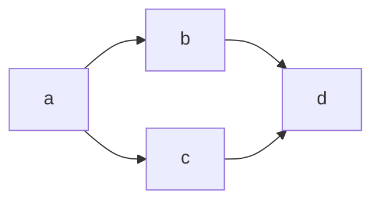

# QiitaCLIのテスト用記事

## 兼 Markdownテスト

### QiitaやGitHub独自記法の確認

/#### Markdownのエスケープ

*hoge* _hoge_ **hoge** __hoge__ ***hoge***
~~fuga~~

#### 非対応っぽい記法[^1] :face_with_rolling_eyes:
==piyo== (※背景の黄色いハイライト)
h~2~SO~4~ (下付き文字)
sinθ^2^ + cosθ^2^ = 1 （上付き文字）
👇
`piyo` (代用)  
$h_2SO_4$
$sinθ^2 + cosθ^2 = 1$

---
#### 折りたたみ
<details>
<summary>audio contents:</summary>
  
- [ゆるコンピュータ科学ラジオ](https://www.youtube.com/@yurucom)
- [ひまじんプログラマーの週末エンジニアリングレッスン](https://open.spotify.com/show/2uv9mONog0nr9q5YJJsvIt?si=e79fc99f3ecd4b8f)
- [エンジニアストーリー by Qiita](https://pitpa.jp/playlist/engineerstory)
- [PIVOT Growth Drivers](https://open.spotify.com/episode/4XoYSjNDuDrM8EMC1RqbPo)
</details>

#### 画像


#### リンク
[Markdown記法 チートシート](https://qiita.com/Qiita/items/c686397e4a0f4f11683d "Qiita Markdown")

##### リンクカード

https://qiita.com/Qiita/items/c686397e4a0f4f11683d

#### コードブロック(Syntax highlight)

```ruby:qiita.rb
require 'redcarpet'
markdown = Redcarpet.new("Hello World!")
puts markdown.to_html
```

```diff_javascript:hogefuga.js
function fancyAlert(arg) {
  if(arg) {
-   console.log('fuga')
+   console.log('hoge')
    $.facebox({div:'#foo'})
  }
}
```

#### 表(テーブル)
※Qiita上で直接編集するバヤイは3x2とかで簡易入力可能
| hoge | fuga | piyo |
|:----:|:----:|:----:|
|  1   |  2   |  3   |
|  4   |  5   |  6   |

#### 引用
> これは引用です
> > これは二重引用です
> * これは引用です

- 箇条書き1
  - 箇条書き1-1
  - 箇条書き1-2
- 箇条書き2

1. 番号付き箇条書き1
   1. 番号付き箇条書き1-1
   2. 番号付き箇条書き1-2
3. 番号付き箇条書き2

- [ ] チェックボックス1
- [x] チェックボックス2

#### Note(補足説明)

:::note info
インフォメーション
infoは省略可能です。
:::

:::note warn
警告
○○に注意してください。
:::

:::note alert
より強い警告
○○しないでください。
:::

#### 注釈と注釈文[^2]

---
#### その他
##### 数式
```math
\frac{1}{n} \sum_{i=1}^{n} x_{i}^{2}
```

$fibo = \\{0, 1, 1, 2, 3, 5, 8\\}$

##### カラー
`#ffce44`
`rgb(255,0,0)`
`rgba(0,255,0,0.4)`
`hsl(100, 10%, 10%)`
`hsla(100, 24%, 40%, 0.5)`

##### ダダダダダイアグラーム！[^3]

```plantuml
Bob->Alice : Hello!
```


### Next article
Flutter1 > 3バージョンアップで躓いたCocoaPodsアップデートについて書く

[^1]: ハイライトは未対応っぽいが、$x^2^ + y^2 = 1$ 等とすると背景が黄色くハイライトされはする。
[^2]: 注釈文はどこに書いても自動で最下部に表示される模様。また、自動で水平線が入る。
[^3]: ばよえ〜ん
